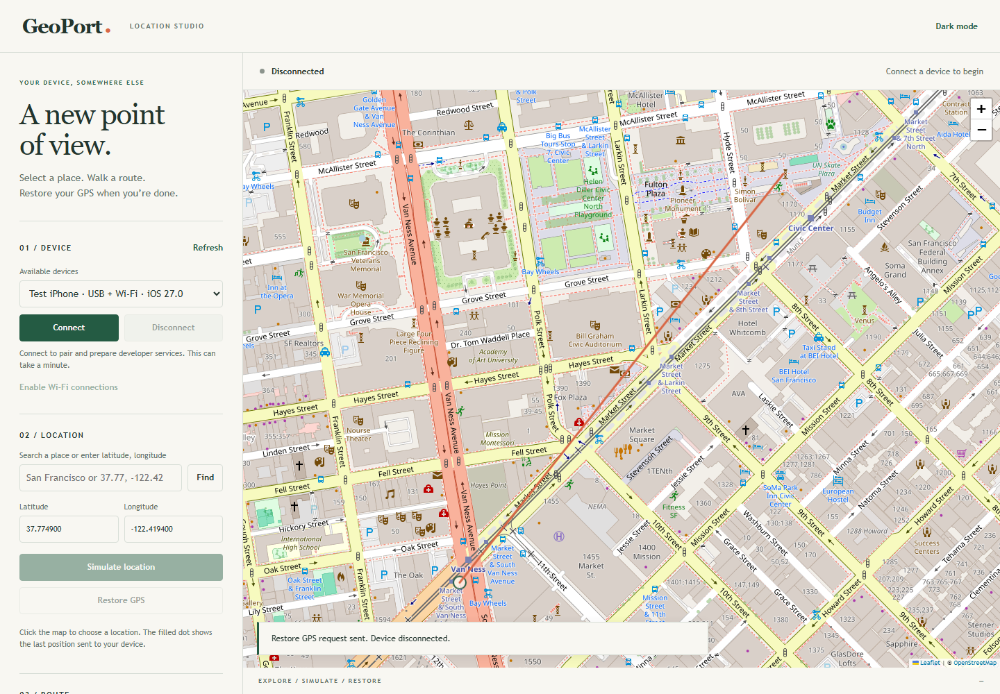

# GeoPort: Your Location, Anywhere! 🌍

Simulate your iPhone's location and routes from a simple map interface.

**[Download GeoPort for Windows](https://github.com/ivan-grebe/GeoPort/releases)** · [Original project](https://github.com/davesc63/GeoPort)



## Key Features

- Set a location using the map, place search, or coordinates.
- Connect and drag numbered route nodes, or import GPX/GeoJSON. Enter a speed in km/h and pause or resume movement.
- On route finish, stop, loop a connected route, restart from the beginning, or travel back and forth indefinitely.
- Connect over USB or supported local Wi-Fi connections.
- Explore Australian fuel prices with Fuel Mode.
- Restore GPS when you're finished.

## Installation

1. Download `GeoPort.exe` from [Releases](https://github.com/ivan-grebe/GeoPort/releases). No Python installation needed.
2. Double-click it to open GeoPort in your browser. Keep the console window open while using it.
3. Connect and unlock your iPhone, accept **Trust This Computer**, and select **Connect** in GeoPort.
4. Choose a location and click **Simulate location**.

**Windows:** Apple Devices or iTunes must be installed to provide Apple's device connectivity services.

**Developer Mode:** Enable it in **Settings → Privacy & Security → Developer Mode**, finish the restart, and confirm on your phone. Keep your passcode enabled.

## App Notes

- This development version targets **iOS 17.4+**. Physical USB/Wi-Fi testing, including iOS 27 beta compatibility, remains outstanding.
- The Windows executable is unsigned. First-time device setup needs internet access to prepare Apple's developer services.
- Use **Restore GPS** when finished. Press **Ctrl+C in GeoPort's console** to shut down normally. Closing the browser tab alone does not stop it.
- For Wi-Fi, pair over USB and enable Wi-Fi connections first. Disconnect, unplug, then reconnect on the same local network. The computer must stay running and reachable.
- Location persistence after disconnection is not guaranteed. If simulation remains active, reconnect and use **Restore GPS**.
- Routes follow the points you supply; automatic road routing is not included. Map tiles, place searches, and optional fuel prices need their online providers.
- **Add nodes** connects map clicks in order. Drag nodes to move them, or use **Add coordinates**. Click the first node while adding, or check **Connect last node to first**, to close a loop. Imports over 200 nodes show draggable endpoints only.
- **Loop** follows the closing segment continuously. **Restart** jumps back to the beginning. **Reverse** retraces the route. These modes repeat until paused or stopped with **Restore GPS**.
- If Connect fails, the page and console report the setup step and error detail. Include that full message when reporting the problem.

## Run From Source

With Python 3.12 installed, run these commands from the repository:

```sh
python -m pip install -r requirements.txt
python src/main.py
```

The app opens at `http://127.0.0.1:54321`. If that port is occupied, use `python src/main.py --port 0`.

Windows release builds are handled by the small [release workflow](.github/workflows/release.yml). Executables are distributed through Releases.

## Tech Stuff and Recognition

This fork builds on [davesc63/GeoPort](https://github.com/davesc63/GeoPort), using Python, Flask, [pymobiledevice3](https://github.com/doronz88/pymobiledevice3), and [Leaflet](https://leafletjs.com/). Map data comes from OpenStreetMap, with GeographicLib for route interpolation.

Licensed under [GPL-3.0](LICENSE).
